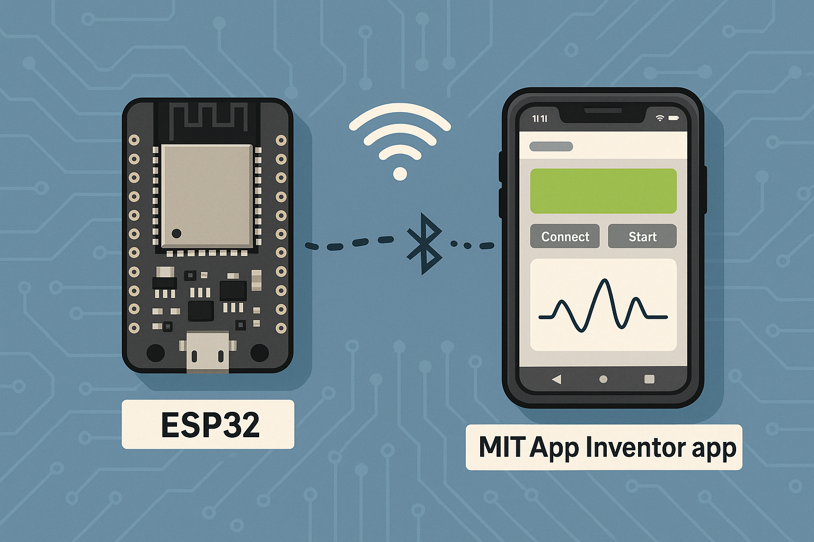

# ⚙️ Taller de Conectividad en el Borde — Fundamentos de Biodiseño  
Taller de conectividad con ESP32 y MIT App Inventor  

   
  <em>Figura 1. Taller de Conectividad en el Borde con ESP32 y MIT App Inventor.</em>

Este repositorio contiene el material completo del **Taller de Conectividad en el Borde** del curso **Fundamentos de Biodiseño**, dictado en el 4.º ciclo de la carrera de Ingeniería Biomédica en la Universidad Peruana Cayetano Heredia (UPCH).

---

## 🎯 Objetivo del taller

Fortalecer competencias en electrónica y desarrollo de aplicaciones móviles para dispositivos biomédicos simples, mediante la integración de un microcontrolador ESP32 y MIT App Inventor, abarcando comunicación Wi-Fi y Bluetooth Low Energy (BLE), adquisición de datos de sensores y visualización en tiempo real.

---

## 🧩 ¿Qué aprenderás?

- Configurar el entorno de desarrollo para ESP32 (Arduino IDE/PlatformIO)  
- Establecer comunicación Wi-Fi y BLE entre ESP32 y la app móvil  
- Diseñar bloques lógicos en MIT App Inventor para conexión, lectura y parseo de datos  
- Integrar un sensor biomédico (pulso, flexión, temperatura) al ESP32 y transmitir sus lecturas  
- Visualizar y graficar datos en tiempo real en la app  
- Depurar errores de conexión y validar la transmisión de datos  

---

## 📂 Contenido del taller

Este repositorio incluye tres ejemplos guiados y un proyecto asincrónico calificable:

### 🔸 Ejemplo 1 – Control de LED por Bluetooth clásico  
Encender y apagar un LED desde una app Android usando Bluetooth serial.  
👉 Tecnologías: `BluetoothClient`, `ListPicker`, control digital básico.

### 🔸 Ejemplo 2 – Control de LEDs por Wi-Fi usando HTTP GET  
Encender y apagar LEDs vía red local mediante un servidor web embebido.  
👉 Tecnologías: `Web` (GET), rutas HTTP, red LAN.

### 🔸 Ejemplo 3 – Control de servomotor vía Wi-Fi con JSON  
Enviar valores desde un slider para posicionar un servo a través de HTTP POST y JSON.  
👉 Tecnologías: `Web.PostText`, `JSONTextEncode`, `Clock`, `Slider`.

---

## 🎯 Proyecto asincrónico calificable – Monitor de flexión en tiempo real

Diseñar e implementar un sistema completo de medición de ángulo usando un **flex sensor** conectado al ESP32, con visualización continua desde una app hecha en MIT App Inventor.

### 🧪 Objetivos del ejercicio
- Leer el sensor de flexión con el ADC del ESP32  
- Servir datos en tiempo real desde un endpoint (`/readADC`)  
- Procesar y visualizar la señal como voltaje o ángulo  
- Implementar interfaz con `WebViewer`, `Chart2D` y gauge

### 📦 Entregables
- Video de demostración (<1 min)  
- Capturas de pantalla de bloques en App Inventor  
- Código Arduino comentado (`.ino`)  
- Informe breve (PDF o Markdown) con detalles de calibración y diseño  

### 📊 Rúbrica de evaluación (20 ptos)
| Criterio | Puntos |
|----------|--------|
| Conexión y lectura estable del sensor | 5 |
| Servidor web funcional y accesible | 4 |
| App recibe datos en tiempo real (<300 ms) | 4 |
| Visualización clara (gauge + gráfico) | 4 |
| Documentación y video demostración | 3 |

---

## 🧪 Fundamentos teóricos integrados

| Concepto    | Aplicación en el taller                                      |
|-------------|--------------------------------------------------------------|
| Wi-Fi / BLE | Protocolos de red para transferencia de datos biomédicos     |
| PWM         | Control de intensidad de señal para actuadores hápticos      |
| ADC         | Lectura analógica de sensores resistivos                     |
| JSON / CSV  | Formatos de datos para comunicación estructurada             |
| BLE GATT    | Comunicación con servicios y características remotas         |

---

## 🧬 Aplicaciones biomédicas relacionadas

- Telemetría de signos vitales en pacientes remotos  
- Sistemas portátiles de monitoreo continuo (wearables)  
- Dispositivos de biofeedback en rehabilitación  
- Interfaces móviles de alerta temprana para cuidados críticos  

---

## 🛠️ Requisitos para experimentar

- **Hardware**  
  - Placa ESP32 (e.g., ESP32-WROOM-32)  
  - Sensor de pulso óptico, sensor de flexión o termistor  
  - Cables Dupont, protoboard o mini PCB  
  - Fuente de alimentación USB 5 V y opcional 6–12 V para actuadores  

- **Software**  
  - Arduino IDE ≥ 1.8.13 o VS Code + PlatformIO  
  - MIT App Inventor 2 (web + App Companion)  
  - Driver USB-Serial para ESP32  

- **Conectividad**  
  - Red Wi-Fi local **o** dispositivo Android con Bluetooth habilitado  

---

## 🧑‍🏫 Créditos

Este material fue desarrollado para el curso **Fundamentos de Biodiseño**  
**Docentes**: Renzo Chan Ríos / Lewis De La Cruz  
**Universidad Peruana Cayetano Heredia (UPCH)** — 2025  
Versión: 1.1  
